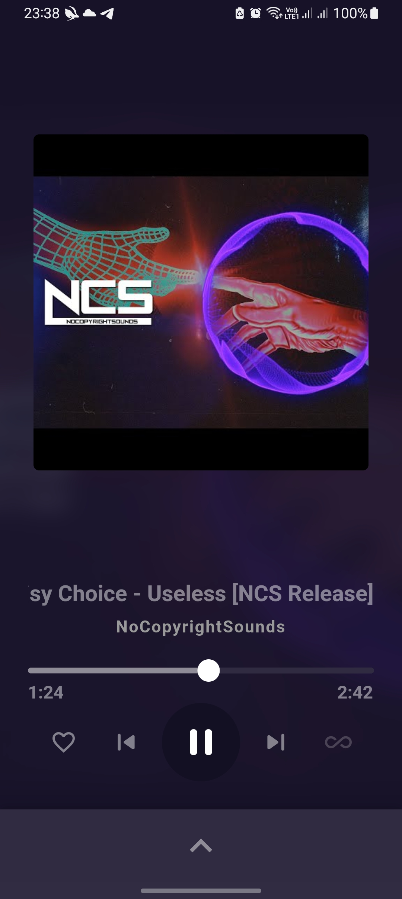
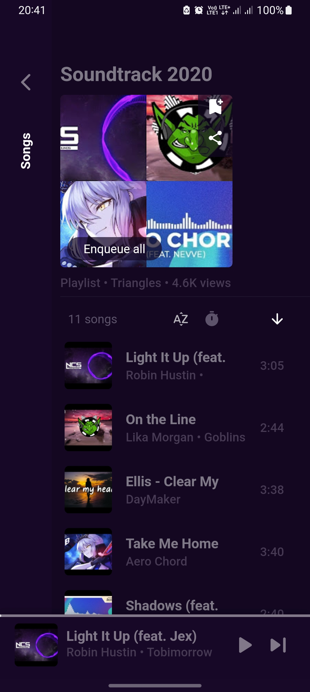

<div align="center">


# 🌌 Odd Verse

<p align="center">
  <strong>The Ultimate High-Performance, Ad-Free Music Streaming Experience</strong><br>
  <em>Powered by Flutter, ExoPlayer & YouTube Music Engine</em>
</p>

[](https://github.com/OddBoyXD/Odd-Verse/releases/latest)
[](https://github.com/OddBoyXD/Odd-Verse/releases)
[](https://github.com/OddBoyXD/Odd-Verse)
[](LICENSE)

<br/>

**Odd Verse** is an open-source, blazing-fast, and ad-free cross-platform music streaming app. Engineered with a custom low-latency ExoPlayer engine, client-side predictive pre-buffering, and seamless offline caching, Odd Verse delivers a pure, uninterrupted, and privacy-first music listening journey.

---

[📥 Download APK](#-download-apks) • [✨ Features](#-features) • [📸 Screenshots](#-screenshots) • [🛠️ Build from Source](#%EF%B8%8F-building-from-source) • [❓ FAQ](#-faq--troubleshooting) • [📄 License](#-license)

</div>

---

## 📸 Screenshots

<div align="center">
  
  
  
  
</div>

---

## ✨ Features

### ⚡ Blazing-Fast Audio Engine
- **Instant Playback Start (0–0.5s)**: Fine-tuned ExoPlayer `AndroidLoadControl` (`150ms` buffer start) ensuring instant audio playback upon tapping any song.
- **5 MB Network Burst Buffering**: Saturated socket data pipelines engineered for 5G and Wi-Fi networks to eliminate buffering stutter.
- **Stale-While-Revalidate Database Caching**: Home feeds, artist hubs, and playlists load in `~2ms` directly from local Hive storage with background silent sync.
- **Predictive Upcoming Song Pre-buffering**: Automatically pre-fetches audio stream URLs for upcoming queue items for seamless next-track transitions.

### 🎤 Synchronized Lyrics & Transliteration
- **Karaoke & Plain Synced Lyrics**: Real-time synchronized lyrics fetched directly from multiple lyric providers.
- **Indic Script Romanization**: Automatic Romanization / Hinglish transliteration for Hindi, Punjabi, Gurmukhi, Tamil, Telugu, and Malayalam lyrics.
- **Live Translation**: Translate lyrics into your local language with a single tap.

### 🛡️ SponsorBlock & Privacy
- **Integrated SponsorBlock**: Automatically and silently skips non-music intros, promotional intervals, sponsor segments, and outros.
- **100% Privacy-Focused**: No ads, no analytics, no tracking, and no required account logins.

### 📤 Sharing & Offline Cache
- **Pure M4A Audio Sharing**: Stream and package pure audio directly to WhatsApp, Telegram, and social apps with an active progress indicator.
- **Granular Cache Management**: 1-tap cache purge and configurable offline cache storage limits.
- **Offline Playback**: Seamlessly listen to cached songs when traveling or disconnected from the internet.

### 🎨 Apple Music-Inspired Aesthetics
- **Material You / Dynamic Theming**: Adaptive color palette extracted in real-time from the currently playing album artwork.
- **Minimalist Clean UI**: Borderless sleek cards, refined typography, and smooth gesture transitions.
- **Full Customization**: Customizable bottom navigation, mini-player styles, dark/light themes, and UI scaling.

---

## 📱 Download APKs

Get the latest official release directly from [GitHub Releases](https://github.com/OddBoyXD/Odd-Verse/releases/latest):

| Architecture | Device Compatibility | Download Link |
| :--- | :--- | :--- |
| **`arm64-v8a`** | Modern 64-bit Android Phones & Tablets *(Recommended)* | [Download ARM64 APK](https://github.com/OddBoyXD/Odd-Verse/releases/latest/download/OddVerse-v1.0.0-arm64-v8a.apk) |
| **`armeabi-v7a`** | Legacy 32-bit Android Devices | [Download ARMv7 APK](https://github.com/OddBoyXD/Odd-Verse/releases/latest/download/OddVerse-v1.0.0-armeabi-v7a.apk) |
| **`x86_64`** | 64-bit Emulators & ChromeOS | [Download x86_64 APK](https://github.com/OddBoyXD/Odd-Verse/releases/latest/download/OddVerse-v1.0.0-x86_64.apk) |
| **`universal`** | All Android Architectures (All-in-One Fat APK) | [Download Universal APK](https://github.com/OddBoyXD/Odd-Verse/releases/latest/download/OddVerse-v1.0.0-universal.apk) |

---

## 🛠️ Building From Source

### Prerequisites
- [Flutter SDK 3.24.3+](https://docs.flutter.dev/get-started/install) (Channel stable)
- [Java JDK 17](https://www.oracle.com/java/technologies/downloads/)
- Android SDK (API Level 34)

### Build Instructions
```bash
# 1. Clone the repository
git clone https://github.com/OddBoyXD/Odd-Verse.git
cd Odd-Verse

# 2. Fetch Flutter packages
flutter pub get

# 3. Build 64-bit Release APK
flutter build apk --release --split-per-abi --target-platform android-arm64

# 4. Build Universal Release APK (All Architectures)
flutter build apk --release
```

The compiled APKs will be generated inside `build/app/outputs/flutter-apk/`.

---

## ❓ FAQ & Troubleshooting

<details>
<summary><strong>🔋 Music stops when the screen is turned off or app is in background</strong></summary>
<br>
Some Android manufacturers (Xiaomi, Samsung, OnePlus, Vivo) aggressively kill background processes to save battery. To ensure uninterrupted playback:
1. Go to your phone's <strong>Settings > Apps > Odd Verse > Battery</strong>.
2. Set Battery Usage to <strong>Unrestricted / No Restrictions</strong>.
3. In Odd Verse settings, ensure <em>Ignore Battery Optimizations</em> is enabled.
</details>

<details>
<summary><strong>🛡️ Android Play Protect warning during installation</strong></summary>
<br>
Because Odd Verse is open-source and distributed directly via GitHub rather than the Google Play Store, Play Protect may display a generic warning on newly signed APKs. Tap <strong>More details > Install anyway</strong> to proceed safely.
</details>

<details>
<summary><strong>📥 How to update without losing playlists and favorites?</strong></summary>
<br>
Simply download and install the new APK over the existing one. All your local Hive data, playlists, favorites, and settings are preserved automatically. You can also export a database backup anytime in <em>Settings > Backup & Restore</em>.
</details>

---

## 🤝 Contributing

Contributions, bug reports, and feature requests are welcome!
1. Fork the repository.
2. Create your feature branch (`git checkout -b feature/AmazingFeature`).
3. Commit your changes (`git commit -m 'feat: Add AmazingFeature'`).
4. Push to the branch (`git push origin feature/AmazingFeature`).
5. Open a Pull Request.

---

## 👤 Author & Maintainer

- **OddBoyXD** — [@OddBoyXD](https://github.com/OddBoyXD)

---

## 📄 License

This project is licensed under the **GNU General Public License v3.0 (GPLv3)** — see the [LICENSE](LICENSE) file for details.

---

## ⚠️ Disclaimer

Odd Verse is an independent open-source music player. All audio, album artwork, and trademarks accessed through the application are the property of their respective copyright holders. Odd Verse does not host or distribute copyrighted content and is not affiliated with, endorsed by, or sponsored by any streaming platform or music label.
